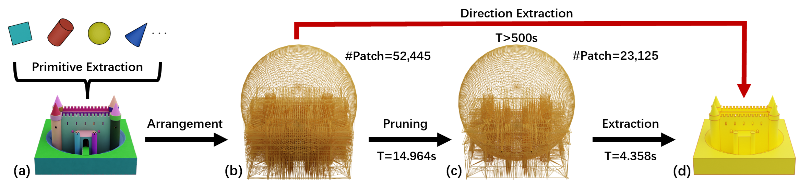

# PrimFit




**PrimFit** is the implementation of reconstruction method described in  paper “**Structure–Aware Surface Reconstruction via Primitive Assembly**”.

等我投完siggraph asia，我一定公开代码，实在不好意思。

Once I finish my SIGGRAPH Asia2024 paper, I will definitely make the code public. I apologize for the delay.

In this paper, we extend the hypothesis and selection idea of plane-baed surface reconstruction method, [PolyFit](https://github.com/LiangliangNan/PolyFit) , to multi-type primitives and introduce an effective pruning mechanism to speed up extraction step (selection) significantly.

## Code

Currently, I am refactoring the code, and it will be available soon. I will upload all the code during winter vacation.

## Citation
If you make use of our work, please cite our paper:

```bibtex
@inproceedings{Jiang2023primfit,
  title={Structure–Aware Surface Reconstruction via Primitive Assembly},
  author={Jingen Jiang, Mingyang Zhao, Shiqing Xin, Yanchao Yang, Hanxiao Wang, Xiaohong Jia, Dong-Ming Yan},
  booktitle={Proceedings of the IEEE/CVF International Conference on Computer Vision},
  year={2023}
}
```

## Acknowledgements

This work was partially funded by the National Key Research and Development Program (2021YFB1715900), the CAS Project for Young Scientists in Basic Research (YSBR-034), the National Natural Science Foundation of China (62172415, 62272277, 12022117), and the HKU-100 Research Award.

Our code is inspired the works of [BSH](https://github.com/duxingyi-charles/Boundary_Sampled_Halfspaces), [PolyFit](https://github.com/LiangliangNan/PolyFit) and [KSR](https://www-sop.inria.fr/members/Florent.Lafarge/code/KSR.zip). We would like to thank Dr. [Xingyi Du](https://duxingyi-charles.github.io/) and Prof. [Liangliang Nan](https://3d.bk.tudelft.nl/liangliang/) for their excellent code.

Furthermore, we are grateful to Jiahui Lv from Shenzhen University for his valuable advice in this work. 

## Maintaince

If any problem, please contact me via <xiaowuga@gmail.com>.


